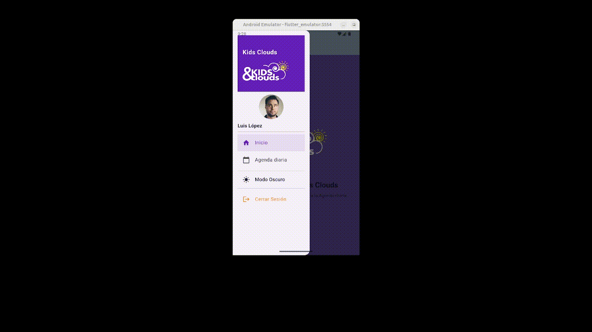

# kids_clouds

## Kids-Clouds: Prueba Técnica - Agenda Diaria Educativa

Este repositorio contiene la resolución de la prueba técnica propuesta por **Kids&Clouds**, consistente en el desarrollo de una **Agenda Diaria** en Flutter para una aplicación educativa, simulando la vista de un padre o madre.

---

## 🚀 Requisitos Funcionales Implementados

Se han abordado los siguientes requisitos funcionales:

### Header con selector de hijo

- Muestra el nombre ficticio del padre/madre: **Luis López**.
- Incluye un selector desplegable (_Dropdown_) con varios hijos inventados.
- La información mostrada en la agenda se filtra según el hijo seleccionado; si no hay selección, se muestran todos los eventos.

### Título principal

- **Agenda diaria**.

### Menú horizontal de categorías (scrollable)

- Permite filtrar los eventos por categorías como:
  - _Alimentación_
  - _Siestas_
  - _Actividades_
  - _Deposiciones_
  - _Observaciones_
- Al seleccionar una categoría, solo se muestran los eventos correspondientes.

### Tarjetas por hijo

- Cada tarjeta muestra la foto del niño (obtenida de una API externa).
- Incluye el nombre del niño, la hora y una descripción del evento.
- Se muestran múltiples tarjetas si un hijo tiene varios eventos en el día.

### Datos simulados

- Se utiliza un JSON mock (o una clase estática) para simular los datos de hijos y eventos, permitiendo variedad en la agenda.

### Diseño limpio y responsive

- La interfaz está diseñada pensando en dispositivos móviles, con una estructura clara y una estética limpia.
- Se ha adaptado el diseño para la versión web (escritorio), buscando una experiencia de usuario óptima en pantallas más grandes.

---

## ✨ Enfoque y Buenas Prácticas

El proyecto ha sido desarrollado siguiendo las siguientes directrices:

- **Arquitectura:** Separación clara de la lógica de negocio, la UI y los datos, buscando un código modular y mantenible.
- **UI/UX:** Diseño intuitivo y visualmente agradable, utilizando los principios de Material Design y adaptabilidad.
- **Gestión de estado:** Uso de una solución adecuada para Flutter para manejar los cambios en la selección de hijos y categorías.
- **Consumo de API:** Integración de APIs externas para obtener imágenes de avatares de niños, demostrando la capacidad de trabajar con servicios web.
- **Código Limpio:** Prioridad en la legibilidad, claridad y adherencia a las convenciones de Flutter y Dart.

---

## 📂 Estructura del Proyecto

```plaintext
lib/
├── core/               # Configuración global, theming, helpers
│   ├── theme.dart
│   ├── theme_provider.dart
│   └── responsive/
│       └── layout_helper.dart
├── data/               # Datos simulados (mock)
│   └── mock_data.dart
├── models/             # Modelos de datos
│   ├── child.dart
│   ├── event.dart
│   └── parent.dart
├── service/            # Servicio para imagen avatar
│   ├── camara_service.dart
├── ui/                 # Widgets y pantallas
│   ├── screens/
│   │   ├── agenda_screen.dart
│   │   └── app_shell.dart
│   ├── components/
│   │   ├── category_menu.dart
│   │   └── event_card.dart
│   └── responsive/
│       └── layout_helper.dart
└── main.dart           # Punto de entrada de la app

test/
├── logic/ # Tests unitarios de modelos y helpers
│   ├── event_category_test.dart
│   ├── layout_helper_test.dart
│   ├── mock_data_test.dart
└── widget/ # Tests de widgets de pantallas principales
    └── app_shell_test.dart/
```

## 🎥 Demo

A continuación se muestra una breve demostración de la aplicación en funcionamiento:



## 🧪 Test Automático

Se han incluido múltiples tests automáticos en la carpeta `test/` del proyecto, cumpliendo con el requisito obligatorio.

### Tests de Lógica

Se han realizado tests unitarios sobre la lógica del proyecto, que validan:

- Las propiedades de la enumeración `EventCategory`, comprobando que cada categoría tiene su etiqueta (_label_) y su icono correspondiente.
- La creación correcta de objetos `Event`, verificando campos obligatorios y opcionales.
- La clase `LayoutHelper`, asegurando que los métodos `isMobile`, `isTablet` e `isDesktop` funcionan correctamente según el ancho de pantalla simulado.
- El mock de datos (`MockData`), asegurando que la inicialización genera los datos esperados y que los identificadores de los hijos son únicos.

### Tests de Widget

Se han realizado tests de integración en Flutter que verifican:

- El widget `AppShell` muestra el icono de menú cuando se renderiza en móvil.
- El `AppBar` de la aplicación muestra el título **Inicio** o **Agenda diaria**, dependiendo de la navegación.
- La navegación dentro del `Drawer` permite acceder a la pantalla de **Agenda diaria**.

Todos los tests se ejecutan con:

```bash
flutter test
